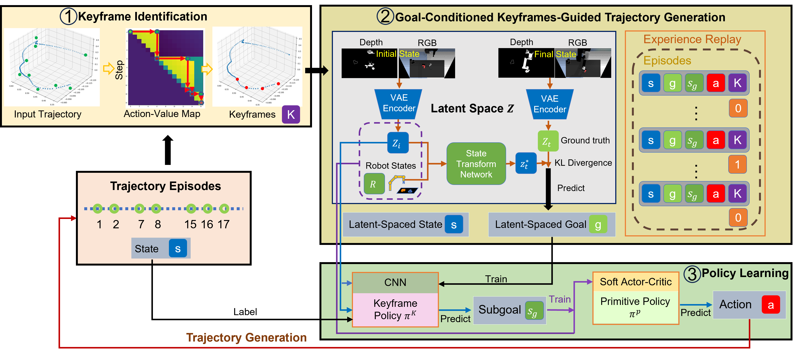
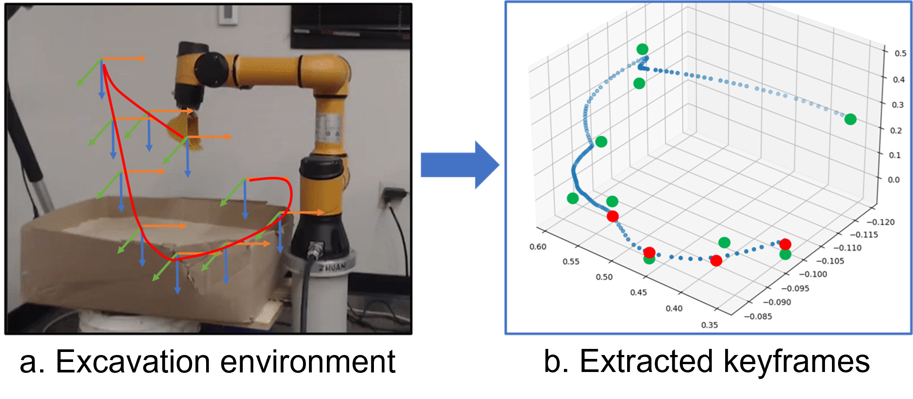
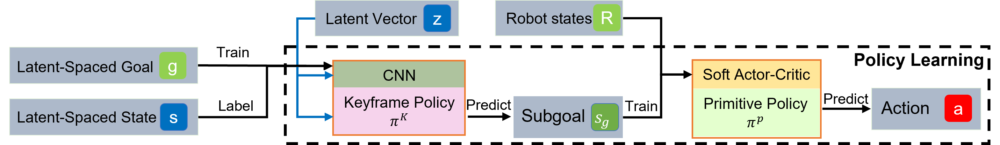
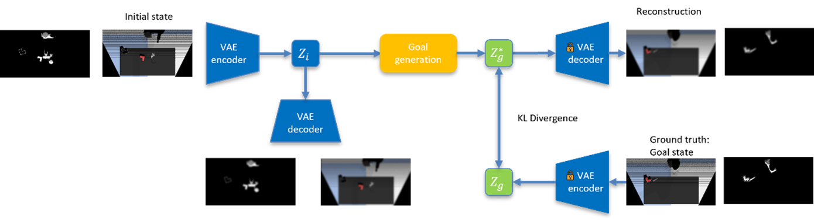
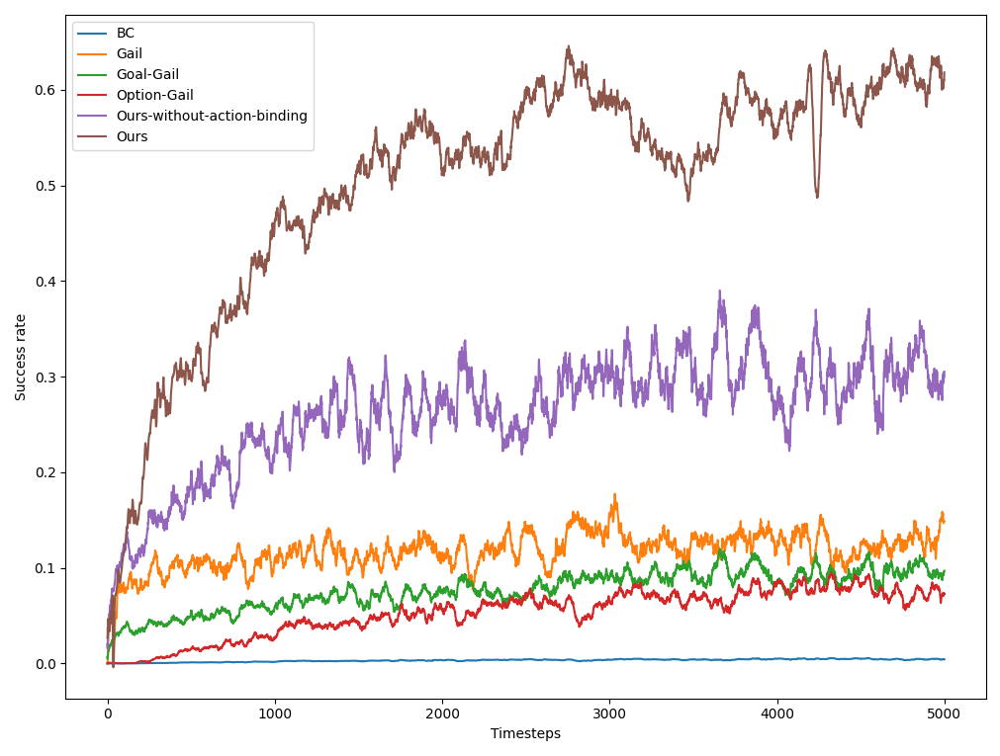
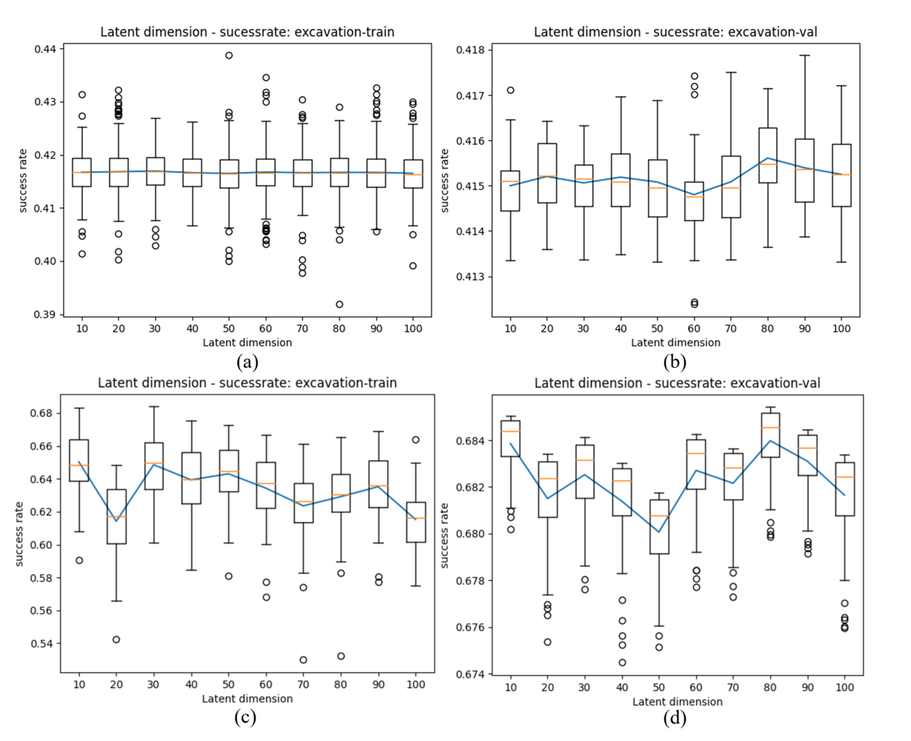

# EasyTeaching: Teach Robot to Learn Manipulation Tasks with Limited Amount of Human Operated Task Demonstrations
This work was done in 2021. 

### Motivation
1. The method can hand over to non robot experts even non machine learning experts.
2. With limited amount of demonstration data provided for the robot as learning references.
3. Versatile: adaptable to multi-type tasks.

### Trajectory Task: a task that need to be done by the trail of the robot passed by.
The following figures illustrate a few trajectory tasks. 

    

To elabrate, the pick and place task can be treated as a special case of trajectory task.

#### Problems & Solution
Teach robot with the trajectory tasks are challenging.
1. Noisy demonstration data:\
  a. Human operator usually have operation habits.\
  b. Explored trajectory is noisy.
2. Low random exploring success rate\
  a. Too many constraints on each trajectory, the computation will explode\
  b. With low random exploration success rate, it is nearly impossible to find a feasible episode within a reasonable time steps
3. Limited demonstration episodes \
  a. Collecting vast amount of demonstration is expensive 

In order to tackle those challenges, we proposed a novel teaching paradigm for the robot to learn the trajectory type tasks. 
1. Keyframe identification from demonstration \
  a. Identify the keyframe from sampled actions 
2. Goal conditioned keyframe guided trajectory generation \
  a. Utilize the keyframe information to train a reinforcement learning policy to generate trajectory \
  b. Use hierarchical structure to overcome the low random exploration success rate problem 
3. Vision based trajectory generation with Latent space exploration\
  a. RGB-D sensor data as system input \
  b. Encode image information into latent space \
  c. Gravity data alignment

#### The overview of the proposed method is shown in following figure. 

The method is seperated into three parts:
1. The keyframe identification method to evaluate the demonstrated data.
2. A reinforcement learning based task exploration and learn from the demonsrated data. 
3. To avoid the ambiguity of image input, we introduced the latent space for the goal generation and robot state representation.

Our approach leverages keyframe identification to train policies via reinforcement learning. These policies generate new trajectories that classify new training data for keyframe identification. To reduce computational load and exploration ambiguity, we condense image features into a latent space using the latent space module. This module is trained separately to optimize performance.

#### Keyframe evaluation from demonstrated task episode. 

We employed a keyframe evaluation approach that involves modeling the task as a shortest path problem from the start state to the goal state. To solve this problem, we utilized a dynamic programming-based reinforcement learning method.

 

The illustration depicts three types of data points: 
* Green dots: Operator inputs that guide the robot's movement. 
* Blue dots: Robot trajectories collected from the robot controller. 
* Red dots: Evaluated keyframes for the task.

Notably, the green dots have drifted away from the blue dots, indicating that human operators teleoperated the robot and fine-tuned its movement while performing the task.

#### The reinforcement learning framework.

Our reinforcement learning framework consists of two policies: a keyframe policy and a primitive policy.

The keyframe policy is trained to generate the optimal keyframe for a task given the current state and final goal state. In contrast, the primitive policy learns to generate actions for the robot to execute by considering the current state and the keyframe as a subgoal of the task.

To facilitate learning, we employ a latent space module that encodes states, subgoals, and goals into a compact representation. This allows our policies to make informed decisions based on the relationships between these entities.

The framework is shown in following figure. 

#### The latent space generation.

Our latent space module is trained using Variational Autoencoders (VAEs) to reduce the search domain for robot exploration. This allows us to condense high-dimensional sensory inputs into a lower-dimensional representation.

To achieve this, we trained our VAE model on a dataset consisting of data collected during both human demonstrations and robot explorations. This enables the latent space module to learn meaningful representations that can effectively guide the robot's exploration strategy.

#### Experiments and Results 
Use this method, we did the experiment with the excavation task. 

##### Human operated task demonstration 
\

##### Trained operation by robot 

##### The success rate is of our method is shown below:

 

#### We also did ablation study on the hyperparameters (the length of the encoded latent space):

### Future work

The latent space and demonstration can be replaced with BLIP image encoder and language encoder. Will explore more on the LLM powered robot learning. 

### Paper
We have submitted this work to the Journal of Computing in Civil Engineering with the following title. The article is accepted and will be published soon. I will update the link after the paper is published. A manuscript of the paper is in the repo. This maynot be the final version. 

[paper](manuscript.pdf)

# Teleoperation-Driven and Keyframe-Based Generalizable Imitation Learning for Construction Robots
## Abstract
The construction industry faces challenges with low productivity and high injury rates. Robots can improve these issues by automating processes. However, teaching robots to perform complex tasks is difficult. We present a framework that uses human teleoperation data to train robots for repetitive construction tasks. First, we developed a teleoperation method and interface to control robots on construction sites. Second, we propose a method to extract keyframes from human operation data, reducing noise and redundancy in the training data. Third, we model the robot's visual observations of the working space to improve learning performance and reduce computational load. We validated our framework by teaching a robot to generate trajectories for excavation tasks using human operators' teleoperations. Results show that our method outperforms existing approaches, demonstrating its potential for application.
